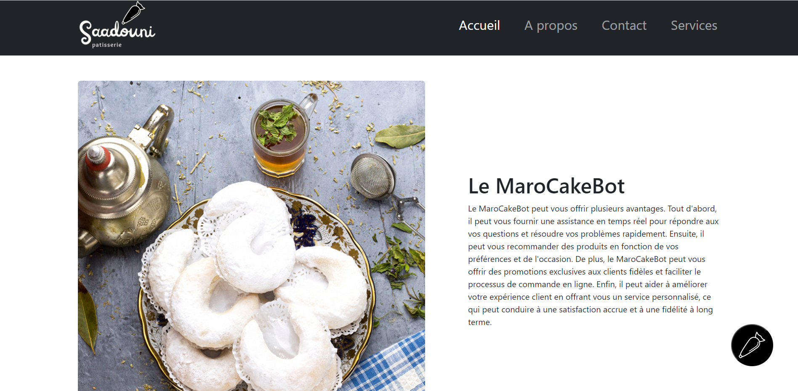
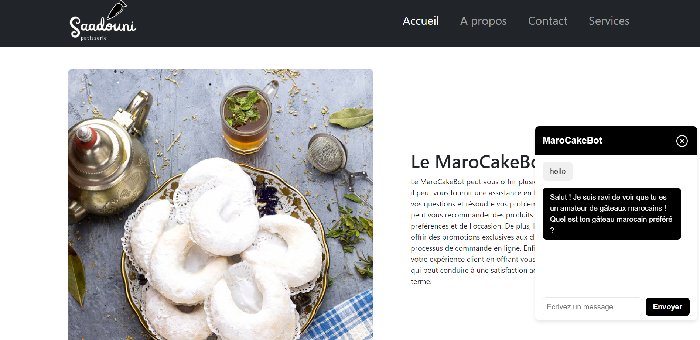

# **PROJECT ELIZA🤖**
## **Description and Goal** ###
This project mainly consisted of creating a chatbot, using the OpenAI API, on the landing page of our brand's website. The goal is to improve the customer experience by offering real-time assistance to answer all user's questions and inform them about the products our brand sells. We named MaroCakeBot because our brand is a company that offers Moroccan cakes and pastries.
***
## **Functionality⚙️** ###
Our chatbot is able to answer any type of questions or requests about Moroccan cakes and pastries. In addition, our landing page offers information about our chatbot and states the benefits of using it.
***
## **Technologies used** ###
```
HTML5 | CSS3 | JAVASCRIPT | OpenAI API
```
***
## **Installation🔧** ###
**1st step:**
- Click on this address which will direct you to the OpenAI website: https://platform.openai.com/account/api-keys
- Log in
- Create an API key, copy it and store it in an .env file ( take example on the .env.example file)

**2nd step:**
- You must install all the dependencies which are express, openai, dotenv, cors, body-parser.
- To do this, execute the command in the terminal:
```
npm i express openai dotenv cors body-parser
```
**3rd step:**
- To launch the project, first you must launch the server
- execute the commands in the terminal:
```
cd API
```
then execute
```
node .
```
- Finally you can run your html page to launch the landing page
***

## **Examples of use🍰** ###
### Example of question: ###
- Quels sont les différents types de gâteaux marocains ?

- Comment sont préparés les cornes de gazelle ?
- Quels sont les ingrédients nécessaires pour faire des briouates ?
- Quelle est l'origine des gâteaux marocains ?
- Comment peut-on décorer des gâteaux marocains traditionnels ?
- Quels sont les gâteaux marocains les plus populaires pour les mariages ?
- Comment faire des ghriba à la noix de coco ?
- Quelle est la différence entre les chebakia et les mkharka ?
- Quels sont les ingrédients de la pastilla aux amandes ?
- Comment préparer un thé à la menthe marocain pour accompagner les gâteaux ?
***
## **Screenshot📷**
***

This is a screenshot of the landing page, you can click on the logo at the bottom right to display the chatbot.


This is a screenshot of the chatbot, you can ask him all the questions or requests you want and if you don't have any ideas you can ask him the example questions I gave you before

***
## **Acknowledgments👏**
Thank you for taking the time to read our README, hope it helps you.
##